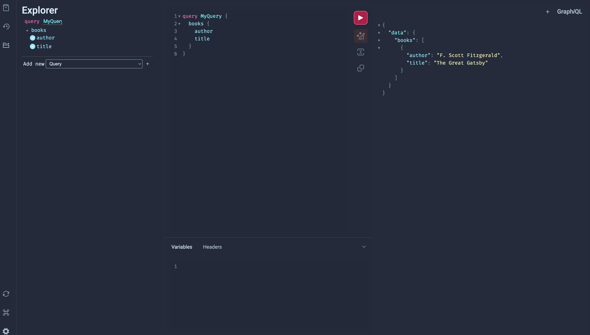

# python-graphql-strawberry-demo

Learn GraphQL with Python Programming with Library Strawberry

## Installation

1. create a virtual environment

```bash
python -m venv venv
```

2. activate the virtual environment

```bash
# on Windows
venv\Scripts\activate
# on Linux or Mac
source venv/bin/activate
```

3. install pip from `requirements.txt` file

```bash
pip install -r requirements.txt
```

4. run the server

```bash
# strawberry server schema --port <PORT_NUMBER>
strawberry server schema --port 9001
```

5. open the browser and go to `http://localhost:9001/graphql` to access the GraphQL playground.

## Result



*Screenshot of the GraphQL playground showing a sample query and its result.*